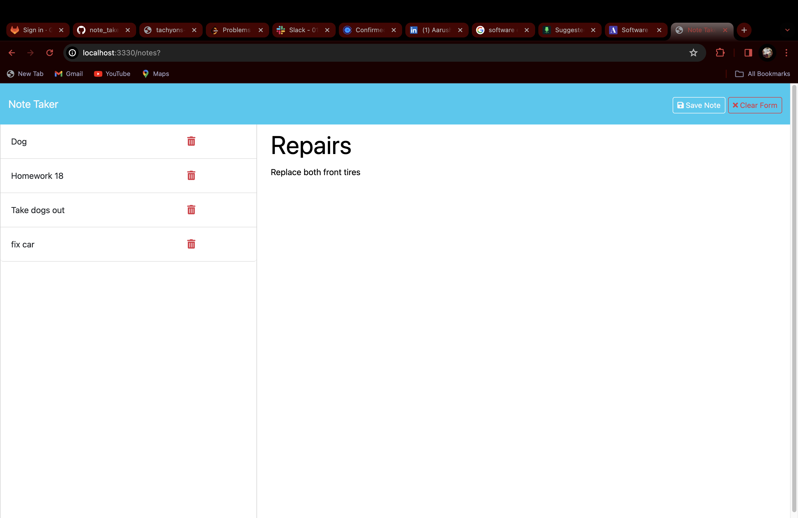

# Note Taker Application

## Description

The Note Taker application is a simple web-based tool that allows users to write and save notes. Users can also view previously saved notes and delete notes they no longer need. The application utilizes an Express.js back end to handle routing and to interact with a JSON file to store the notes data.

## Installation

To run the Note Taker application locally, follow these steps:

1. Clone this repository to your local machine.
2. Navigate to the project directory in your terminal.
3. Install dependencies by running `npm install`.
4. Start the application by running `npm start`.
5. Open your web browser and go to `http://localhost:3330` to access the application.

## Usage

Once the application is running, you can use it to perform the following actions:

- **View Notes**: Click on the "Note Taker" title in the navigation bar to view saved notes.
- **Add a Note**: Click on the "+" button in the navigation bar to start adding a new note. Enter a title and text for your note, then click the save button (floppy disk icon) to save the note.
- **Delete a Note**: Click on the trash can icon next to a note in the list to delete that note.

## Technologies Used

- Node.js
- Express.js
- JavaScript
- HTML
- CSS

## Deployment

The Note Taker application can be deployed to Heroku or any other cloud platform that supports Node.js applications. Follow the platform-specific instructions for deploying Node.js applications to deploy the Note Taker application.

## Demo

## License

This project is licensed under the [MIT License](LICENSE).
